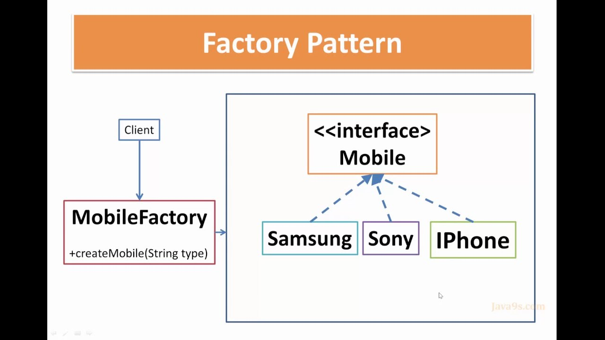
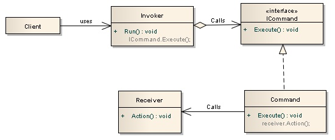

# Napredno programiranje - zadaci

## Uvod
Trenutno naš JNotepad ima osnovne funkcionalnosti za pisanje po njemu, 
međutim nemamo
zapravo još nikakve prave funkcionalnosti koje bi očekivali od bilokojeg 
pristojnog text editora.
U nastavku ćemo se bozabaviti sa nekim malo kompliciranijim konceptima.

## Oblikovni obrazac *Factory*
Vec smo pricali o ovome, pa necu previse duljiti. Implementirali smo klase 
potrebne za ovaj obrazac. Općeniti UML dijagram ovog obrasca se nalazi ispod.
pokušaj povezati komponente dijagrama s našim implementacijama. 

## Oblikovni obrazac *Naredba*
Česta je pojava da u našim programskim rješenjima trebamo nekakav mehanizam 
za obavljanje nekakvih konkretnih radnji. Prvo što nam pada na pamet je da 
implementramo najobičniju funkciju koja ce se na neki način pozvati u vrijeme
kada je to potrebno. Problem nastaje u tome što mi moramo smislit nekakav 
mehanizam koji određuje koja se radnja treba obaviti, tj koja se funkcija 
treba pozvati. Ocemo raditi if-else, switch-case il što već? NE! 

Također još jedna bitna stvar kod radnji u našem rješenju je da želimo da 
imaju neke zajedničke karakteristike i slične postupke. Zajedničke 
karakteristike==atributi, slični postupci==metode, metode+atributi==KLASA!!!

Dada, ispostavlja se da je često najbolje rješenje ovaj problem riješiti 
direktnom primjenom objektne paradigme, stvarajući strukturu klasa i sučelja 
koja je dana na slici:

Ajmo vidjt koji se klinac ovdje dešava. 
 - **Client**: To si ti, tj tvoja aplikacija. U svakom slučaju to je objekt koji
  šalje nekome informaciju da treba nešto da uradi.
  
 - **Invoker**: To je objekt koji posjeduje reference na konkretne akcije o 
 kojima cijelo vrijeme pričamo, no također zna i kako ih adekvatno pozvati. U
  ovom slučaju to će biti pojedine grafičke komponente koje će znati kada su 
  aktvirane koju akciju ili akcije pozvati. 
  
 - **ICommand**: Apstraktno sučelje koje označava ggeneralnu akciju i 
 najcesce samo ejdnu metodu koju je potrebo implementirati
 
 - **Command**: Konkretna implementacija naredbe
 
 - **Receiver**: Opcionalan objekt, stvar na koju se odrazavaju posljedice 
 naredbe
 
 U Javi postoji sučelje action, međutim mi se necemo s njime borit previse. 
 Postoji 